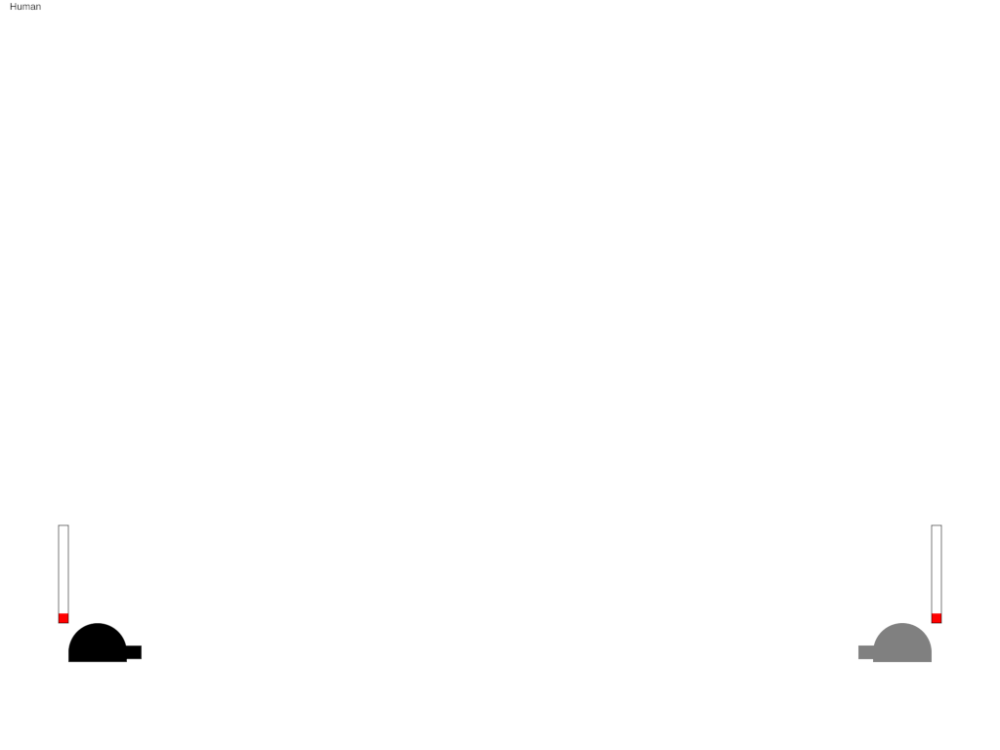

# BangBang

[live version](https://victorribeiro.com/bangBang)  
[alternative link](https://victorqribeiro.github.io/bangBang/)  

## About

Play BangBang against a Neural Network (Dejavu, a toy neural network that I wrote myself).
The Neural Network is fresh each round, it will shoot at random at the first time then it will learn how to improve it's accuracy, until it hits you; if you don't hit it first.

## How to Play

### On Desktop

**Left** and **Right** arrows **rotate** the cannon. **Up** and **Down** arrows increase and decrease the **strength** of the projectile. **Spacebar shoots**.

### On Mobile

**Touch and drag up and down** on the **right** side of the screen to **rotate** the cannon.
**Touch and drag up and down** on the **left** side of the screen to adjust the **strength**.
**Tap the screen** to **shoot**.
